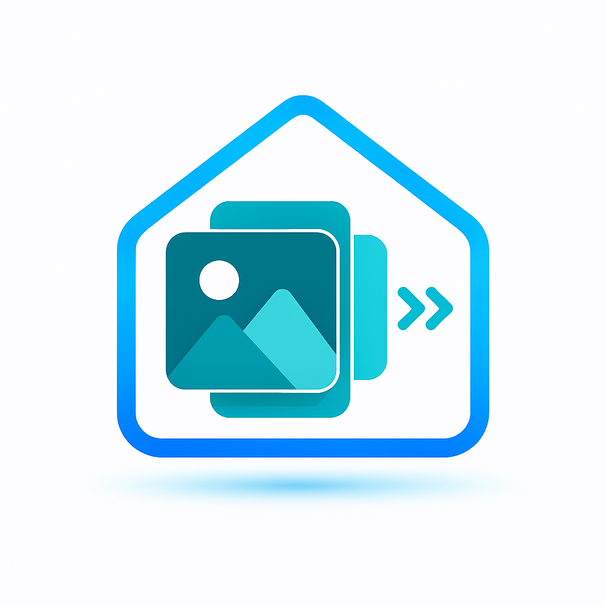

# SharePoint Photos Integration for Home Assistant

<p align="center">
  
</p>

A complete Home Assistant custom integration that displays random photos from your SharePoint folders.
This code was generatde by GPT5.1-Codex.

## Features

✅ **Random Folder Selection** - Automatically picks random folders from your year/month/event structure  
✅ **Recursive Folder Scanning** - Discovers all photo folders in your SharePoint hierarchy  
✅ **Microsoft Graph API** - Secure authentication using Azure AD  
✅ **Real-time Updates** - Background refresh with coordinator pattern  
✅ **Recent Folder History** - Configurable limit keeps the last N folders out of rotation  
✅ **Folder Quality Filter** - Enforce a minimum number of photos before a folder enters the rotation  
✅ **Rich Sensors** - Multiple sensors with photo URLs as attributes  
✅ **Services** - Manual refresh and folder selection services  
✅ **Configuration UI** - Easy setup through Home Assistant UI  

### Icon & Branding

The repository includes a custom logo (`logo.png`) for documentation previews, HACS tiles, or dashboards. The integration icon for Home Assistant remains at `custom_components/sharepoint_photos/icon.svg`.

## Installation

### 1. Copy Integration Files
All files are already created in: `custom_components/sharepoint_photos/`

### 2. Restart Home Assistant
Restart Home Assistant to load the new integration.

### 3. Set up Azure AD Application

#### Create App Registration:
1. Go to [Azure Portal](https://portal.azure.com)
2. Navigate to **Azure Active Directory** > **App registrations**
3. Click **New registration**
4. Name: `Home Assistant SharePoint Photos`
5. Account types: `Accounts in this organizational directory only`
6. Redirect URI: Leave empty
7. Click **Register**

#### Configure API Permissions:
1. Go to **API permissions**
2. Click **Add a permission**
3. Select **Microsoft Graph**
4. Choose **Application permissions**
5. Add these permissions:
   - `Sites.Read.All`
   - `Files.Read.All`
6. Click **Grant admin consent**

#### Create Client Secret:
1. Go to **Certificates & secrets**
2. Click **New client secret**
3. Description: `HA SharePoint Photos`
4. Expires: `24 months` (recommended)
5. Copy the **Value** (you won't see it again!)

#### Note Down Values:
- **Tenant ID**: From Overview page
- **Application (client) ID**: From Overview page  
- **Client Secret**: From the secret you just created

### 4. Configure Integration

1. Go to **Settings** > **Devices & Services**
2. Click **Add Integration**
3. Search for **SharePoint Photos**
4. Enter your Azure AD details:
   - **Tenant ID**: Your Azure AD tenant ID
   - **Client ID**: Application ID from Azure
   - **Client Secret**: Secret value from Azure
   - **Site URL**: Full SharePoint site URL (e.g., `https://yourdomain.sharepoint.com/sites/photos`)
   - **Library Name**: Document library name (default: `Documents`)
   - **Base Folder Path**: Path to photo folders (e.g., `/Photos`)
  - **Recent Folder History Size**: Number of previously selected folders to avoid when refreshing (default: `30`, set to `0` to disable)
    - **Minimum Photos Per Folder**: Only include folders that contain at least this many photos (default: `5`)

## How It Works

### Single Folder Display
The integration shows photos from **ONE folder at a time**:
- ✅ **Current folder**: Selected randomly from your SharePoint structure
- ✅ **Photo rotation**: Cycles through photos within the current folder every 10 seconds  
- ✅ **Folder changes**: Only when manually refreshed or triggered by automation
- ✅ **No automatic folder switching**: Folders stay the same until explicitly refreshed

### ✅ **Image Proxy for Full Quality**
The integration includes a built-in image proxy that:
- ✅ **Serves full-quality images** through Home Assistant URLs
- ✅ **Handles SharePoint authentication** automatically
- ✅ **Short URLs** (e.g., `/api/sharepoint_photos/image/abc123/5`)
- ✅ **Browser compatible** - works with any frontend
- ✅ **Cached responses** - 1-hour cache for better performance

### Manual Control
- **Manual refresh**: Use `sharepoint_photos.refresh_photos` service to get a new random folder
- **Specific folder**: Use `sharepoint_photos.select_folder` service to choose a specific folder
- **Automation control**: Create automations to control when folders change

## Sensors Created

The integration creates these sensors:

### `sensor.sharepoint_photos_current_photo_folder`
- **State**: Current folder name
- **Entity Picture**: Currently rotating picture (changes every 10 seconds)
- **Attributes**: 
  - `photos`: Array of photo objects with URLs
  - `photo_urls`: Simple array of photo URLs  
  - `current_picture_url`: Currently rotating picture URL
  - `folder_path`: Full folder path
  - `photo_count`: Number of photos
  - `rotation_cycle_seconds`: 10 (rotation interval)

### `sensor.sharepoint_photos_photo_count`
- **State**: Number of photos in current folder
- **Unit**: photos

### `sensor.sharepoint_photos_folder_path`
- **State**: Full path to current folder

### `sensor.sharepoint_photos_last_updated`
- **State**: Timestamp of last update
- **Device Class**: timestamp

### `sensor.sharepoint_photos_current_picture_url`
- **State**: Short description of current photo (e.g., "Photo 3: IMG_20241015_142030.jpg")
- **Entity Picture**: Full-quality image via proxy URL (changes every 10 seconds)
- **Attributes**: 
  - `total_photos`: Total number of photos in current folder
  - `current_index`: Current photo index (1-based)
  - `current_photo_url`: Direct SharePoint URL (may be thumbnail)
  - `current_photo_proxy_url`: High-quality proxy URL (recommended for display)
  - `current_photo_thumbnail`: Low-quality thumbnail URL  
  - `current_photo_download_url`: Full SharePoint download URL with auth tokens
  - `current_photo_web_url`: SharePoint web interface URL
  - `current_photo_name`: Filename of current photo
  - `cycle_time_seconds`: 10 (rotation interval)
  - `folder_name`: Current folder name

## Image Entity Created

### `image.sharepoint_photos_current_picture`
- **Image**: Current photo rendered as an image entity (updates every 10 seconds)
- **Recommended for**: `media-entity-image://` URLs and wallpanel displays

## Services

### `sharepoint_photos.refresh_photos`
Get a new random photo folder from SharePoint.

```yaml
service: sharepoint_photos.refresh_photos
```

### `sharepoint_photos.select_folder`
Select a specific folder by path.

```yaml
service: sharepoint_photos.select_folder
data:
  folder_path: "/Photos/2024/Vacation"
```

## Lovelace Card Examples

### Entity Picture Cards (using entity_picture attribute)

```yaml
# Simple entity card with rotating picture (uses entity_picture automatically)
type: entity
entity: sensor.sharepoint_photos_current_picture_url
```

```yaml
# Using media-entity-image protocol for wallpanel/custom cards
type: picture
image: "media-entity-image://image.sharepoint_photos_current_picture"
title: "{{ states('sensor.sharepoint_photos_current_photo_folder') }}"
```

```yaml
# Entities card with picture
type: entities
entities:
  - entity: sensor.sharepoint_photos_current_photo_folder
  - entity: sensor.sharepoint_photos_photo_count
  - entity: sensor.sharepoint_photos_current_picture_url
show_header_toggle: false
```

```yaml
# Glance card with rotating pictures
type: glance
entities:
  - entity: sensor.sharepoint_photos_current_photo_folder
    name: Current Folder
  - entity: sensor.sharepoint_photos_current_picture_url
    name: Rotating Picture
columns: 2
```

### Auto-rotating Picture Display

```yaml
type: picture
image: "{{ state_attr('sensor.sharepoint_photos_current_picture_url', 'current_photo_proxy_url') }}"
title: >
  {{ states('sensor.sharepoint_photos_current_photo_folder') }} 
  ({{ state_attr('sensor.sharepoint_photos_current_picture_url', 'current_index') }}/{{ state_attr('sensor.sharepoint_photos_current_picture_url', 'total_photos') }})
tap_action:
  action: call-service
  service: sharepoint_photos.refresh_photos
```

### Basic Photo Display

```yaml
type: picture
image: >
  
  
    {{ photos[0] }}
  
    /local/placeholder.jpg
  
title: "{{ states('sensor.sharepoint_photos_current_photo_folder') }}"
tap_action:
  action: call-service
  service: sharepoint_photos.refresh_photos
```

### Photo Slideshow (rotates through images)

```yaml
type: picture
image: >
  
  
    {% set index = now().second % photos|length %}
    {{ photos[index] }}
  
    /local/placeholder.jpg
  
title: >
  {{ states('sensor.sharepoint_photos_current_photo_folder') }} 
  ({{ states('sensor.sharepoint_photos_photo_count') }} photos)
```

### Control Panel

```yaml
type: entities
title: SharePoint Photos Control
entities:
  - entity: sensor.sharepoint_photos_current_photo_folder
    name: Current Folder
  - entity: sensor.sharepoint_photos_photo_count
    name: Photo Count
  - entity: sensor.sharepoint_photos_folder_path
    name: Folder Path
  - entity: sensor.sharepoint_photos_last_updated
    name: Last Updated
footer:
  type: buttons
  entities:
    - entity: script.refresh_sharepoint_photos
      name: Refresh
      icon: mdi:refresh
      tap_action:
        action: call-service
        service: sharepoint_photos.refresh_photos
```

### Picture Elements with Overlay

```yaml
type: picture-elements
image: >
  
  
    {{ photos[0] }}
  
    /local/placeholder.jpg
  
elements:
  - type: state-label
    entity: sensor.sharepoint_photos_current_photo_folder
    style:
      top: 5%
      left: 50%
      color: white
      background-color: rgba(0,0,0,0.7)
      padding: 10px
      border-radius: 10px
      font-size: 16px
  - type: state-label
    entity: sensor.sharepoint_photos_photo_count
    prefix: "Photos: "
    style:
      top: 5%
      right: 5%
      color: white
      background-color: rgba(0,0,0,0.7)
      padding: 5px
      border-radius: 5px
  - type: service-button
    title: Next Folder
    service: sharepoint_photos.refresh_photos
    style:
      bottom: 5%
      right: 5%
      background-color: rgba(0,0,0,0.7)
      color: white
      border-radius: 50%
      padding: 15px
    icon: mdi:refresh
```

### Custom Gallery Card (if you have a gallery card installed)

```yaml
# Single rotating image using high-quality proxy
type: custom:gallery-card
entities:
  - entity: sensor.sharepoint_photos_current_picture_url
title: "{{ states('sensor.sharepoint_photos_current_photo_folder') }}"
# Use the proxy URL for full quality
image: "{{ state_attr('sensor.sharepoint_photos_current_picture_url', 'current_photo_proxy_url') }}"
```

### Full Gallery with All Photos (using proxy URLs)

```yaml
type: custom:gallery-card
entities:
  - entity: sensor.sharepoint_photos_current_photo_folder
title: "{{ states('sensor.sharepoint_photos_current_photo_folder') }}"
# Create proxy URLs for all photos in the folder
images_path: >
  
  
    
    
      
        
      
    
    {{ proxy_urls }}
  
    []
  
maximum_files: 20
```

### Alternative Gallery (fallback to original URLs)

```yaml
type: custom:gallery-card
entities:
  - entity: sensor.sharepoint_photos_current_photo_folder
title: "{{ states('sensor.sharepoint_photos_current_photo_folder') }}"
images_path: "{{ state_attr('sensor.sharepoint_photos_current_photo_folder', 'photo_urls') }}"
maximum_files: 20
```

## Automation Examples

### ✅ **Automated Folder Management**
A complete automation file has been created at `/config/automations/sharepoint_photos.yaml` that includes:

- **Auto-refresh every 6 hours**: Automatically switches to new random folders
- **Startup refresh**: Gets a new folder when Home Assistant starts  
- **Manual refresh button**: For immediate folder changes
- **Scheduled refresh**: Optional timed refreshes (morning, afternoon, evening)
- **Change notifications**: Logs and optionally notifies when folders change

The automations ensure you see content from only ONE folder at a time, with folder changes only happening when explicitly triggered.

### Manual Service Calls

### Manual Service Calls

#### Get new random folder:
```yaml
service: sharepoint_photos.refresh_photos
```

#### Select specific folder:
```yaml
service: sharepoint_photos.select_folder
data:
  folder_path: "/Photos/2024/Vacation"
```

### Custom Automation Examples

If you want to customize the folder refresh behavior beyond the provided automation file:

#### Refresh on specific events:
```yaml
automation:
  - id: sharepoint_photos_custom_refresh
    alias: "SharePoint Photos - Custom Refresh"
    trigger:
      - platform: state
        entity_id: person.wolfgang  # Example: when you come home
        to: "home"
      - platform: sun
        event: sunrise
    action:
      - service: sharepoint_photos.refresh_photos
```

#### Weekend-only refresh:
```yaml
automation:
  - id: sharepoint_photos_weekend_refresh
    alias: "SharePoint Photos - Weekend Refresh"
    trigger:
      - platform: time_pattern
        hours: "/3"  # Every 3 hours on weekends
    condition:
      - condition: time
        weekday:
          - sat
          - sun
    action:
      - service: sharepoint_photos.refresh_photos
```

## Troubleshooting

### Common Issues

1. **Authentication Failed**
   - **Check credentials**: Verify Tenant ID, Client ID, and Client Secret are correct
   - **API permissions**: Ensure `Sites.Read.All` and `Files.Read.All` permissions are granted
   - **Admin consent**: Make sure admin consent is granted for the permissions
   - **Client secret**: Check that client secret hasn't expired
   - **Tenant ID format**: Should be a GUID (e.g., `12345678-1234-1234-1234-123456789012`)
   - **Authority URL**: The integration tries `https://login.microsoftonline.com/{tenant_id}`

2. **Site Not Found**
   - **Site URL format**: Must be full URL like `https://yourdomain.sharepoint.com/sites/sitename`
   - **Site permissions**: Ensure the app has access to the SharePoint site
   - **Site existence**: Verify the site exists and is accessible

3. **Library Not Found**
   - **Library name**: Default is "Documents" - change if your library has a different name
   - **Library permissions**: Ensure the app can access the document library
   - **Case sensitivity**: Library names are case-sensitive

4. **No Photos Found**
   - **Base folder path**: Verify the folder path exists (e.g., `/Photos`)
   - **Folder structure**: Check folders contain actual image files
   - **Image extensions**: Supported: jpg, jpeg, png, gif, bmp, webp, tiff
   - **Permissions**: Ensure app can read files in the folders

5. **MSAL Blocking Issues**
   - The integration now uses direct HTTP authentication first, then falls back to MSAL
   - If you see "blocking call" errors, check the logs for direct HTTP method results

6. **Photos Not Loading in UI**
   - **URL length**: SharePoint URLs can be very long (1000+ chars) and may cause issues
   - **Authentication required**: Images may require authentication headers
   - **Thumbnail URLs**: The integration tries to use thumbnail URLs when available (no auth required)
   - **Browser compatibility**: Some SharePoint URLs work better in browsers than others
   - **Network issues**: Check browser network tab for HTTP errors
   - **CORS issues**: Some SharePoint configurations may block cross-origin requests
   - **Wallpanel issues**: Long URLs may cause wallpanel frontend errors

7. **Alternative Display Methods**
   - Use `entity_picture` attribute instead of direct URL templates
   - Consider using thumbnail URLs if available in attributes
   - For wallpanel: Try shorter update intervals or use entity cards instead of direct URLs

### Debug Logging

Add to `configuration.yaml`:

```yaml
logger:
  default: info
  logs:
    custom_components.sharepoint_photos: debug
```

### Manual Testing

Test your configuration with Developer Tools:

```yaml
service: sharepoint_photos.refresh_photos
```

Check the logs for any errors and verify sensors update correctly.

## Advanced Configuration

### Multiple SharePoint Sites
You can configure multiple SharePoint sites by adding the integration multiple times with different site URLs.

### Folder Filtering
Modify the `api.py` file to add custom folder filtering logic based on:
- Date ranges
- Folder names
- Photo count
- Last modified dates

### Custom Photo Selection
The integration randomly selects folders. You can modify the selection algorithm in `api.py` to:
- Weight by folder age
- Prefer folders with more photos
- Exclude recently shown folders
- Filter by specific criteria

## File Structure

```
custom_components/sharepoint_photos/
├── __init__.py              # Main integration entry point
├── api.py                   # SharePoint Graph API client
├── config_flow.py           # Configuration UI flow
├── const.py                 # Constants and configuration
├── manifest.json            # Integration metadata
├── sensor.py                # Sensor entities
├── services.yaml            # Service definitions
├── strings.json             # UI text
└── translations/
    └── en.json              # English translations
```

This integration provides a robust foundation for displaying your SharePoint photos in Home Assistant. Customize the folder selection logic and Lovelace cards to match your specific needs!
